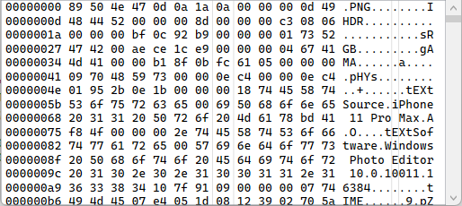

# XHexEditor

A WPF hex editor control.



## Features

### Bookmarks

You can bookmark an offset and move the current caret position between bookmarks:


You can programatically set the bookmarks and move between them via the `Bookmarks` property:
```csharp
// Add a bookmark
editor.Bookmarks.Add(new Bookmark(ByteIndex: 10, Name: null))

// Move to next/previous bookmark
editor.MoveToNextBookmark();
editor.MoveToPreviousBookmark();
```

### Highlights

You can apply a highlight colors to a range of bytes:


You can programatically set the highlights via the `HighlightRanges` property:
```csharp
editor.HighlightRanges.Add(new HighlightRange(StartIndex: 0, EndIndex: 10, Brush: Brushes.Red));
```

## Usage

Add the hex editor control to your xaml
```csharp
<Window x:Class="MyApp.MainWindow"
        xmlns="http://schemas.microsoft.com/winfx/2006/xaml/presentation"
        xmlns:he="clr-namespace:XHexEditor.Wpf;assembly=XHexEditor.Wpf"
        Title="MainWindow" Height="450" Width="800">
    
    <Grid>
        <he:HexEditor x:Name="editor" />
    </Grid>
    
</Window>
```

To load data into the control, create a `XHexEditor.Providers.StreamProvider` and assign it to the `Provider` property on the control:
```csharp
editor.Provider = new StreamProvider(new FileStream(@"C:\pictures\cali.png", FileMode.Open));
```

### Saving changes

You can determine if the user has made any changes using the `IsModified` property and save the changes to the underlying stream using the `ApplyChangesAsync` method:
```csharp
if (editor.IsModified)
{
    WindowInteropHelper helper = new WindowInteropHelper(this);

    // Tell the editor to apply the changes to the underlying stream
    Task task = editor.ApplyChangesAsync(cancellation: default, progress: null);

    // Display a progress dialog while the editor is applying the changes
    ProgressDialog.Show(task, helper.Handle, String.Empty, String.Empty, null, null);
}
```

> :information_source: **ProgressDialog** is from https://github.com/richard-mcintyre/XTaskDialog

## Example Application

This repository contains an example application using the hex editor control using the project `XHexEditor.Wpf.App\XHexEditor.Wpf.App.csproj`.